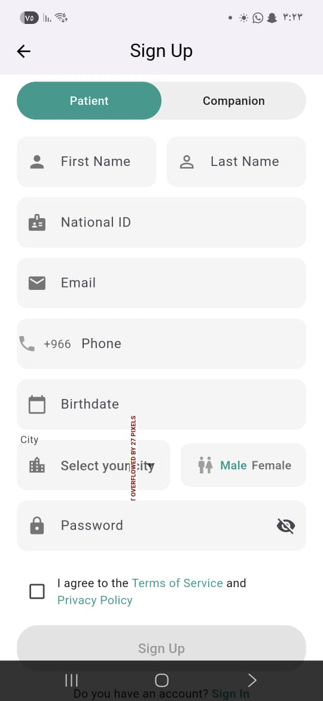
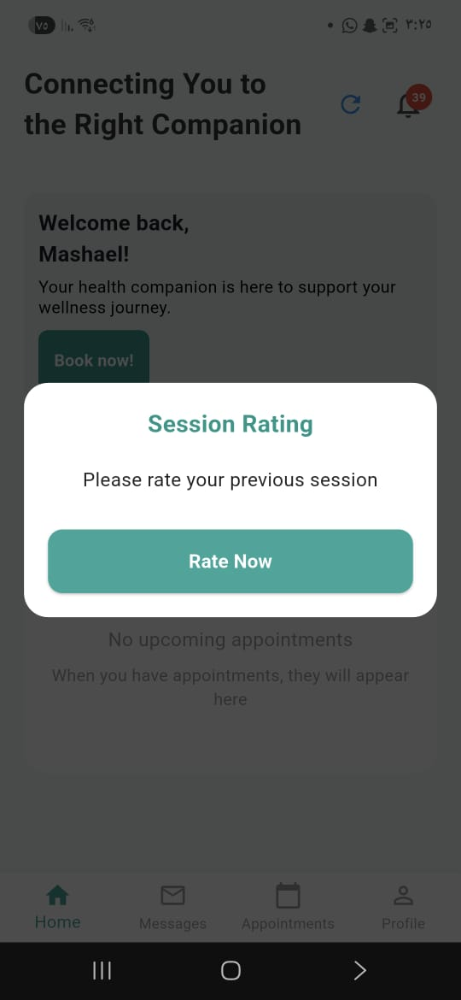
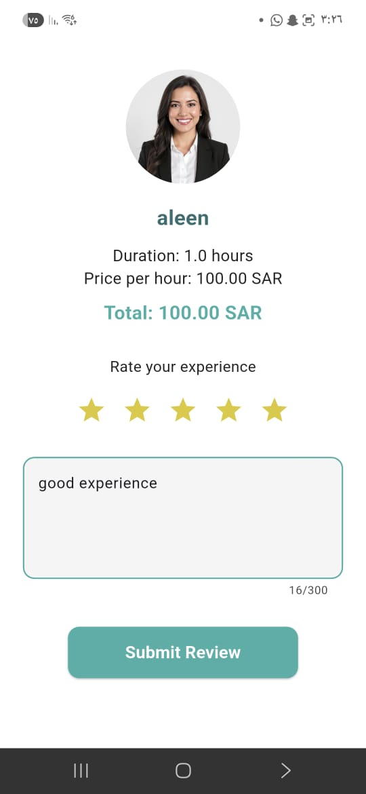

## Rafiqni – Mobile Application Showcase

### Overview

Rafiqni is a mobile application that connects patients with companions who can assist them during hospital visits. The app allows users to book companions based on time and location, track them, and complete the service with integrated payment.

This repository showcases my contributions to the project. The full source code is not included due to repository privacy.

---

### My Contributions

I worked as part of a development team and contributed to the following features:

#### Payment Integration

* Contributed to integrating the payment system (Stripe) into the application.
* Supported the implementation of a secure and smooth payment flow for booking companions.
* Worked on handling user interactions related to payments.

#### Rating System

* Implemented the feature that allows patients to rate companions after completing the service.
* Designed the rating flow to ensure a simple and effective user experience.
* Contributed to linking ratings with companion profiles.

#### User Interface Development

* Collaborated with the team in designing and implementing application interfaces.
* Developed UI components using Flutter.
* Focused on building a clean and user-friendly interface.

---

### Tech Stack

* Flutter
* Firebase
* Stripe (Payment Integration)
* Google Maps API

---
### Screenshots

#### Sign Up

#### Screen 2

#### Screen 3

#### Screen 4

#### Screen 5

#### Screen 6

#### Screen 7

---

### Notes

This repository is intended to present my work and contributions. It does not include the complete original project due to access restrictions.
